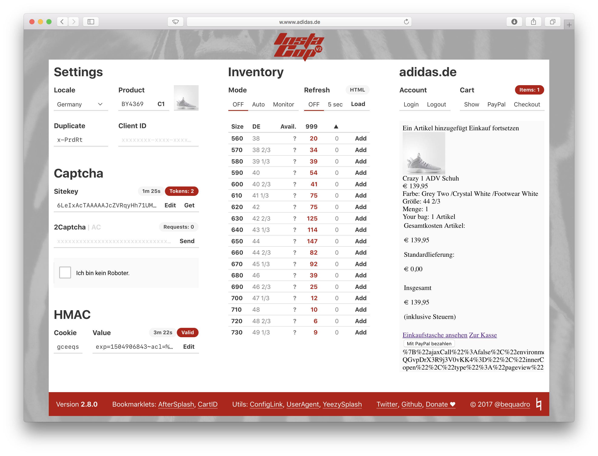

<h1 align="center">
	 
	
	 
	 
</h1>

> Enhanced shopping experience for the adidas.com online store.

I decided to open source my adidas.com script. This has been in development since the day after I failed to get the 750 Grey/Gum manually, back in the days when you only had to generate a backdoor link with a captcha response.

Like the infamous Solemartyr script, InstaCop runs solely in the browser and is therefore limited in its scope.

**This will not help you get through splash.**

# Features

- Single Page Interface
- 3 Stock Checking Methods
- Auto Refresh, Auto ATC & Restock Monitor
- Captcha Harvesting
- 2Captcha & AntiCaptcha Support
- HMAC Cookie Management

# Installation

Installation is similar to Solemartyr's. Type the macOS commands into `Terminal.app`.

### 1. Download and unzip

   

### 2. Start a local server

   ###### macOS

   Terminal: `sudo apachectl start`.

   ###### Windows

   Install MAMP or XAMPP.

### 3. Put the files into the server root folder

   Make sure to place `index.html` and the `instacop` folder directly on the root.

   ###### macOS

   Go to `/Library/WebServer/Documents`.

   ###### Windows

   Look for some folder called `htdocs`, e.g. `C:\MAMP\htdocs`.

### 4. Open your host file

   ###### macOS

   Terminal: `sudo nano /private/etc/hosts`.

   ###### Windows

   Edit `C:\Windows\System32\Drivers\etc\hosts` as admin.

### 5. Edit your host file

   Add the following line, where `.tld` is your country's top level domain (`.com` for US, `.de` for Germany, ...).

   `127.0.0.1 w.www.adidas.tld`

   Do not forget the additional `.w`.

### 6. Save your host file

   ###### macOS

   Press `Ctrl+x` to exit, `y` to confirm, `Enter` to save.

   ###### Windows

   Just save the file.

### 7. Open InstaCop in your browser

   Use the domain you specified in step 5.

# Usage

## Parameters

Get the necessary parameters during release (Sitekey, ClientID, Duplicate) from Twitter, Reddit or whatever.

You can retrieve the sitekey for the currently loaded PID with the `Get` button.

If you get through splash yourself, you can use the `AfterSplash` bookmarklet on the splash page. Just enter your local URL to transfer the values to InstaCop.

## Stock Checking

Avail. | Stock | ▲
--- | --- | ---
Pairs that are ready to be carted | Current stock including cart holds | Difference in stock between refreshes

**Client** stock checking is the primary method and the only one that can show avail. pairs. It checks the Demandware API with the provided ClientID key.

**HTML** stock checking is the first fallback method and usually shows the same stock amount as *Client*. It scrapes the product page for stock numbers.

**Variant** stock checking is the second fallback and uses an adidas.com endpoint, but the numbers are way off nowadays.

You can force the fallback options toggling the `Avail.` and `Stock` table headers.

## Auto Mode

`Auto` ATC Mode adds the size with the highest avail. number. Only works with *Client* stock checking.

`Monitor` alerts the stock number during each refresh with a browser notification. Works best with Auto Refresh.

Select the `Refresh` timout and click again to change the number.

## Captchas

The default sitekey is a Google test key that always resolves without popup. Changing the sitekey with the `Edit` button reloads InstaCop.

Import and export all your tokens by clicking on the `Token` badge.

You can toggle between [2Captcha](https://2captcha.com?from=3920048) and [AntiCaptcha](http://getcaptchasolution.com/bu8krdp7o3) by clicking on the header.

*Disclaimer: referral links.*

## HMAC

The HMAC coookie value cannot be changed without clicking the `Edit` button. This aims to prevent accidental changes.

Included in the download is a HMAC test page, which is accessible by navigating to `w.www.adidas.tld/hmac` and sets a fake cookie for 10 minutes. Do not use this during release!

## Config

Most of the editable values are saved locally. You can export them to another browser window by dragging the `ConfigLink` (located at the bottom under `Utils`).

There is also a preset option for the product code. Right click the button between product code and image. Use the following format: `PRODUCT_NAME,PRODUCT_CODE`.

# Support

I will provide absolutely no support regarding setup and usage. Contact me If you find a bug.

# Contributing

Feature-wise we are probably at the limit of what can be done with a client side script. If you think of something, contact me or open a pull request.

## About the code

Please excuse the (in parts) messy code. This was my first JavaScript project.

I put everything in a single Vue.js component. `app.js` and `inventory.js` are coupled in a strange way. The CSS on top of bulma.css has way too many `!important`s in it.

I also did not use any build tools for this project, which is kind of insane, but makes forking it easier for you.

Unfortunately, I don't have the time to refactor this project. If you'd like to contribute, please contact me or submit a pull request.

# License

☠️ Anyone on sneaker twitter trying to sell this in any shape or form can rot in hell.
